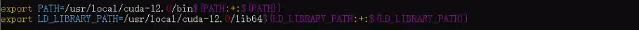
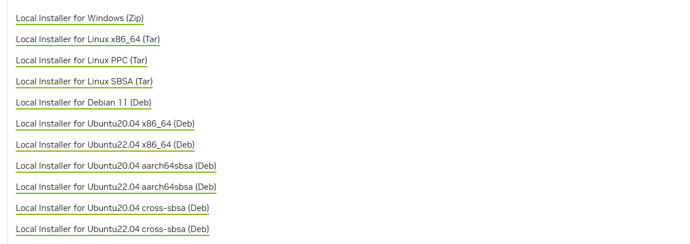
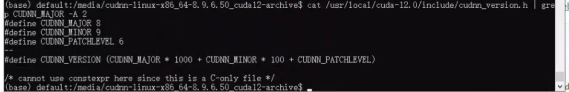

# Yolo v5 TensorRT


## 开发环境搭建

**在Windows中使用Ubuntu进行开发**


### docker

- **nvidia/cuda:11.4.3-cudnn8-devel-ubuntu20.04**

​	选择已经搭建好cuda以及cudnn的docker容器，在vscode中连接容器进行开发。（在可视化上不是很好）

- **kasmweb/ubuntu-bionic-desktop:1.10.0-rolling**

  使用kasmweb镜像，自己搭建环境

  

  1. 拉取镜像，创建容器（官方教程）

     ```
     # 拉取镜像
     docker pull kasmweb/ubuntu-bionic-desktop:1.10.0-rolling
     # 创建容器
     docker run --name ubuntu --gpus all -v D:\ubuntu:/data --shm-size=8g -p 6901:6901 -p 1935:1935 -p 8554:8554 -e VNC_PW=password -it 98bf226b9df33f4e8cb83b5db92efa30e83c129b097eaae8ca56838700bb63e7
     # 访问
     https://ip:6901
     ```
  
  2. 解决不能update
  
     通过桌面的terminal执行命令：
  
     ```
     apt update
     ```
  
     发现报错：
  
     
  
     这是在Windows中打开cmd，输入命令：
  
     ```
     # 进入容器（ubutnu为你的容器名）
     docker exec -it -u 0 ubuntu bash
     useradd default
     passwd default
     # 输入密码
     ```
     
     完成上面的操作后，可以在cmd中正常操作：
     
     
     
  3. 换源
  
     ```
     vim /etc/apt/sources.list
     
     # 阿里
     deb http://mirrors.aliyun.com/ubuntu/ focal main restricted universe multiverse
     deb-src http://mirrors.aliyun.com/ubuntu/ focal main restricted universe multiverse
     deb http://mirrors.aliyun.com/ubuntu/ focal-security main restricted universe multiverse
     deb-src http://mirrors.aliyun.com/ubuntu/ focal-security main restricted universe multiverse
     deb http://mirrors.aliyun.com/ubuntu/ focal-updates main restricted universe multiverse
     deb-src http://mirrors.aliyun.com/ubuntu/ focal-updates main restricted universe multiverse
     deb http://mirrors.aliyun.com/ubuntu/ focal-proposed main restricted universe multiverse
     deb-src http://mirrors.aliyun.com/ubuntu/ focal-proposed main restricted universe multiverse
     deb http://mirrors.aliyun.com/ubuntu/ focal-backports main restricted universe multiverse
     deb-src http://mirrors.aliyun.com/ubuntu/ focal-backports main restricted universe multiverse
     
     # 中科大
     deb https://mirrors.ustc.edu.cn/ubuntu/ focal main restricted universe multiverse
     deb-src https://mirrors.ustc.edu.cn/ubuntu/ focal main restricted universe multiverse
     deb https://mirrors.ustc.edu.cn/ubuntu/ focal-updates main restricted universe multiverse
     deb-src https://mirrors.ustc.edu.cn/ubuntu/ focal-updates main restricted universe multiverse
     deb https://mirrors.ustc.edu.cn/ubuntu/ focal-backports main restricted universe multiverse
     deb-src https://mirrors.ustc.edu.cn/ubuntu/ focal-backports main restricted universe multiverse
     deb https://mirrors.ustc.edu.cn/ubuntu/ focal-security main restricted universe multiverse
     deb-src https://mirrors.ustc.edu.cn/ubuntu/ focal-security main restricted universe multiverse
     deb https://mirrors.ustc.edu.cn/ubuntu/ focal-proposed main restricted universe multiverse
     deb-src https://mirrors.ustc.edu.cn/ubuntu/ focal-proposed main restricted universe multiverse
     
     # 163
     deb http://mirrors.163.com/ubuntu/ focal main restricted universe multiverse
     deb http://mirrors.163.com/ubuntu/ focal-security main restricted universe multiverse
     deb http://mirrors.163.com/ubuntu/ focal-updates main restricted universe multiverse
     deb http://mirrors.163.com/ubuntu/ focal-proposed main restricted universe multiverse
     deb http://mirrors.163.com/ubuntu/ focal-backports main restricted universe multiverse
     deb-src http://mirrors.163.com/ubuntu/ focal main restricted universe multiverse
     deb-src http://mirrors.163.com/ubuntu/ focal-security main restricted universe multiverse
     deb-src http://mirrors.163.com/ubuntu/ focal-updates main restricted universe multiverse
     deb-src http://mirrors.163.com/ubuntu/ focal-proposed main restricted universe multiverse
     deb-src http://mirrors.163.com/ubuntu/ focal-backports main restricted universe multiverse
     ```

     

     换完源再执行更新，可能会存在无法访问到dl.google.com的问题：
  
     ```
     vim /etc/hosts
     
     203.208.41.32 dl.google.com
     203.208.41.32 dl-ssl.google.com
     203.208.41.32 groups.google.com
     203.208.41.32 goo.gl
     203.208.41.32 appengine.google.co
     ```

     

  4. 安装cuda 与 cudnn

     docker中默认存在显卡驱动：

     

     对应一下版本：

     

     选择适合的版本进行下载（[CUDA Toolkit Archive | NVIDIA Developer](https://developer.nvidia.com/cuda-toolkit-archive)）：

     

     选择对应版本的runfile文件，运行命令：
  
     ```
     sh cuda_12.0.0_525.60.13_linux.run
     ```

     按照默认选择进行install，完成后添加环境变量：
  
     ```
     vim ~/.bashrc
     
     export PATH=/usr/local/cuda-12.0/bin${PATH:+:${PATH}}
     export LD_LIBRARY_PATH=/usr/local/cuda-12.0/lib64${LD_LIBRARY_PATH:+:${LD_LIBRARY_PATH}}
     
     source ~/.bashrc
     ```

     
  
     ```
     nvcc -V
     ```

     

     下载cudnn（[cuDNN Archive | NVIDIA Developer](https://developer.nvidia.com/rdp/cudnn-archive)）

     

     下载压缩包，解压并复制到对应文件夹
  
     ```
     tar -xf cudnn-linux-x86_64-8.9.6.50_cuda12-archive.tar.xz
     
     cd cudnn-linux-x86_64-8.9.6.50_cuda12-archive
     
     cp include/cudnn* /usr/local/cuda-12.0/include
     cp lib/libcudnn* /usr/local/cuda-12.0/lib64
     chmod a+r /usr/local/cuda-12.0/include/cudnn.h 
     chmod a+r /usr/local/cuda-12.0/lib64/libcudnn*
     
     # 验证
     cat /usr/local/cuda-12.0/include/cudnn.h | grep CUDNN_MAJOR -A 2
     # 或者
     cat /usr/local/cuda-12.0/include/cudnn_version.h | grep CUDNN_MAJOR -A 2
     ```

     

  5. 安装anaconda

     下载anaconda的sh包安装，完成安装后，添加环境变量：
  
     ```
     sh Anaconda3-2024.02-1-Linux-x86_64.sh 
     
     vim ~/.bashrc
     
     export PATH=$PATH:/usr/local/anaconda3/bin
     
     source ~/.bashrc
     ```

     

  6. 安装TensorRT（[TensorRT Download | NVIDIA Developer](https://developer.nvidia.com/tensorrt/download)）

     下载tar文件，解压并添加环境变量：
  
     
  
     ```
     tar -xzvf TensorRT-8.6.1.6.Linux.x86_64-gnu.cuda-12.0.tar.gz
     # 添加环境变量
     vim ~/.bashrc
     export LD_LIBRARY_PATH=$LD_LIBRARY_PATH:/usr/local/TensorRT-8.6.1.6/lib
     source ~/.bashrc
     # 验证
     cd /usr/local/TensorRT-8.6.1.6/samples/sampleOnnxMNIST
     make
     cd /usr/local/TensorRT-8.6.1.6/bin
     ./sample_onnx_mnist
     ```

     
  
     安装python版本：
  
     ```
     conda create -n tensorrt python=3.9
     conda activate tensorrt
     cd /usr/local/TensorRT-8.6.1.6/python
     pip install tensorrt-8.6.1-cp39-none-linux_x86_64.whl
     ```

  7. 安装opencv

     opencv-4.80（[opencv/opencv at 4.8.0 (github.com)](https://github.com/opencv/opencv/tree/4.8.0)）：
  
     opencv_contrib-4.80（[opencv/opencv_contrib at 4.8.0 (github.com)](https://github.com/opencv/opencv_contrib/tree/4.8.0)）
  
     ```
     # c++
     unzip opencv.zip
     unzio opencv-contrib.zip
     mkdir opencv
     mv opencv-4.80 /media/opencv
     mv opencv_contrib-4.80 /media/opencv
     cd opencv-4.80
     mkdir build
     cd build
     cmake -D CMAKE_BUILD_TYPE=RELEASE -D CMAKE_INSTALL_PREFIX=/usr/local/opencv -D CMAKE_C_COMPILER=/usr/bin/gcc-9 -D INSTALL_PYTHON_EXAMPLES=OFF -D INSTALL_C_EXAMPLES=ON -D OPENCV_ENABLE_NONFREE=ON -D BUILD_opencv_python3=OFF -D WITH_CUDA=ON -D WITH_CUDNN=ON -D WITH_TBB=ON -D OPENCV_DNN_CUDA=ON -D ENABLE_FAST_MATH=1 -D CUDA_FAST_MATH=1 -D WITH_CUBLAS=1 -D OPENCV_GENERATE_PKGCONFIG=ON -D OPENCV_EXTRA_MODULES_PATH=/usr/local/opencv/opencv_contrib-4.8.0/modules -D CUDNN_LIBRARY=/usr/local/cuda-12.0/lib64/libcudnn.so.8.9.6 -D CUDNN_INCLUDE_DIR=/usr/local/cuda-12.0/include -D CUDA_CUDA_LIBRARY=/usr/local/cuda-12.0/lib64/stubs/libcuda.so -D WITH_WEBP=OFF -D WITH_OPENCL=OFF -D ETHASHLCL=OFF -D ENABLE_CXX11=ON -D BUILD_EXAMPLES=OFF -D OPENCV_ENABLE_NONFREE=ON -D WITH_OPENGL=ON -D WITH_GSTREAMER=ON -D WITH_V4L=ON -D WITH_QT=OFF -D BUILD_opencv_python3=OFF -D BUILD_opencv_python2=OFF -D HAVE_opencv_python3=OFF ..
     make -j20（根据cpu核数量决定）
     make install
     # python
     cd ..
     mkdir build_python
     cmake -D CMAKE_BUILD_TYPE=RELEASE -D CMAKE_INSTALL_PREFIX=/usr/local/anaconda3/envs/tensorrt -D OPENCV_EXTRA_MODULES_PATH=/usr/local/opencv/opencv_contrib-4.8.0/modules -D PYTHON_DEFAULT_EXECUTABLE=/usr/local/anaconda3/envs/tensorrt/bin/python -D PYTHON3_EXECUTABLE=/usr/local/anaconda3/envs/tensorrt/bin/python -D PYTHON3_INCLUDE_DIR=/usr/local/anaconda3/envs/tensorrt/include/python3.9 -D PYTHON3_PACKAGES_PATH=/usr/local/anaconda3/envs/tensorrt/lib/python3.9/site-packages -D PYTHON3_LIBRARY=/usr/local/anaconda3/envs/tensorrt/lib/libpython3.9.so -D BUILD_opencv_java=OFF -D CUDA_TOOLKIT_ROOT_DIR=/usr/local/cuda-12.0 -D WITH_OPENGL=ON -D WITH_OPENCL=ON -D WITH_OPENMP=OFF -D INSTALL_C_EXAMPLES=OFF -D OPENCV_ENABLE_NONFREE=ON -D WITH_CUDA=ON -D WITH_CUDNN=ON -D OPENCV_DNN_CUDA=ON -D ENABLE_FAST_MATH=1 -D CUDA_FAST_MATH=1 -D WITH_CUBLAS=1  -D BUILD_EXAMPLES=ON -D HAVE_opencv_python3=ON -D BUILD_opencv_python2=OFF -D BUILD_TIFF=ON ..
     make -j20
     make install
     cd python_loader
     /usr/local/anaconda3/envs/tensorrt/bin/python setup.py install
     # 如果导入cv2 libffi.so.7报错，备份libffi.so.7
     ln -s /lib/x86_64-linux-gnu/libffi.so.7.1.0 libffi.so.7
     ```

     **注意：**在编译时需要将环境变量中的conda环境变量注释，避免编译报错

     
  
     使用apt安装c++版本（没有contrib模块，不能使用cuda）：

     ```
     apt install libopencv-dev
     ```
  
     使用pip安装python版本（没有contrib模块，不能使用cuda）：

     ```
     pip install opencv-python
     ```
  
     ***重点：上面所述的操作都是在Windows环境下的cmd中进行的，回到桌面时，可能会发现某些文件操作不了（包括cp进入的文件，但是我们在桌面操作的文件没有这个问题），这个时候需要更改一下文件的所有者：***
  
     ```
     chown -R default 文件
     ```

8. ffmpeg

   ```
   
   wget http://ftp.videolan.org/pub/videolan/x265/x265_2.6.tar.gz
   tar -xvf x265_2.6.tar.gz
   cd x265_v2.6/build/linux/
   sh ./make-Makefiles.bash
   make
   make install
   
   
   git clone https://git.videolan.org/git/ffmpeg/nv-codec-headers.git
   cd nv-codec-headers/
   make
   make install
   
   
   tar -xvf ffmpeg_4.3.1.orig.tar.xz
   cd ffmpeg-4.3.1/
   ./configure --prefix=/usr/local/ffmpeg --enable-shared --disable-static --disable-doc  --enable-gpl --enable-libx265 --enable-cuda --enable-cuvid
   make
   make install
   
   vim /etc/ld.so.conf
   include /etc/ld.so.conf.d/*.conf
   /usr/local/ffmpeg/lib
   ```

   

9. mediamtx

   ```
   git clone https://github.com/bluenviron/mediamtx
   # 启动服务
   ./mediamtx
   ```

   

### vscode配置

- VS Code建议安装插件列表：

  - MS-CEINTL.vscode-language-pack-zh-hans

- C++开发

  - ms-vscode.cpptools

- python开发

  - ms-python.python

- 代码补全

  - TabNine.tabnine-vscode

  - GitHub.copilot

    

## Yolo v8


### 训练

训练数据文件地址：https://pan.baidu.com/s/1AnTB6ANkV_HZ7U9_DaT4-A?pwd=1vgs

训练结果文件地址：https://pan.baidu.com/s/1EY9B_G6aL1RNJrCBarJTxw?pwd=tzj5

验证结果：

```
                 Class     Images  Instances          P          R      mAP50   mAP50-95: 100%|██████████| 999/999 [00:53<00:00, 18.57it/s]
                   all        999      28392      0.557      0.359      0.464      0.276
           pedestrians        999      17805      0.862      0.824      0.879       0.66
                riders        999        185      0.707       0.47      0.611      0.342
partially-visible persons        999       9335      0.576      0.324      0.442      0.195
        ignore regions        999        406      0.463      0.153      0.296      0.146
                 crowd        999        661      0.176     0.0242     0.0939     0.0386
Speed: 0.7ms pre-process, 23.8ms inference, 2.0ms NMS per image at shape (1, 3, 640, 640)

                 Class     Images  Instances          P          R      mAP50   mAP50-95: 100%|██████████| 999/999 [00:55<00:00, 17.87it/s]
                   all        999      28392      0.557      0.359      0.464      0.276
           pedestrians        999      17805      0.862      0.824      0.879       0.66
                riders        999        185      0.707       0.47      0.611      0.342
partially-visible persons        999       9335      0.576      0.324      0.442      0.195
        ignore regions        999        406      0.463      0.153      0.296      0.146
                 crowd        999        661      0.176     0.0242     0.0939     0.0386
Speed: 0.7ms pre-process, 24.2ms inference, 2.1ms NMS per image at shape (1, 3, 640, 640)
```


### 转换

存在多种转换tensorrt模型的路径，这里选择onnx作为中间件，执行命令转换onnx模型：

```
python export.py /home/kasm-user/yolov5/runs/train/exp/weights/best.pt --include onnx --simplify --dynamic
```


***补充重点：***

- 使用tensorrt plugin对网络进行改进

  - YoloLayer plugin：将网络的解码部分去除，改变网络结构为两个输出头（配合官方的NMS plugin）
  - NMS plugin：将网络的output改进（根据plugin来决定）

  

tensorrt官方实现的batchedNMSPlugin（[TensorRT/plugin/batchedNMSPlugin at release/8.6 · NVIDIA/TensorRT (github.com)](https://github.com/NVIDIA/TensorRT/tree/release/8.6/plugin/batchedNMSPlugin)）：

plugin有两个输入和四个输出：

- 输入：
  - box：[batch_size,number_boxes,number_classes,number_box_parameters]
    - batch_size：批次（n）
    - number_boxes：框的数目（对于yolov5来说（20×20+40×40+80×80）×3）
    - number_classes：有两种选择1或者类别数(在为所有类生成单个框预测的情况下：例如在EfficientDet或SSD中，框输入可以具有3个维度，或者在为每个类生成单独的框预测时：例如在FasterRCNN中，可以具有4个维度，在这种情况下，number_classes>=1，并且必须与分数输入中的类的数量相匹配。。)
    - number_box_parameters：对应的左上角和右下角坐标
  - cls_conf：[batch_size,number_boxes,number_classes]
    - number_classes：可以理解为yolov5中每个类别的cls_conf

***补充：由于官方实现的这个NMS plugin适用于SSD，可以看到输入是没有置信度的，与yolov8的输出相适配（对于v5存在conf，可以在YoloLayer中先判断conf，再将符合conf条件的输出去掉conf的数据，以此来配合官方的NMS plugin）***

- 输出
  - num_detections：批次
  - nmsed_boxes：
    - keepTopK：参数 nms后最多保留的目标框
  - nmsed_scores
  - nmsed_classes


为了在网络中插入plugin，首先需要将网络的输出进行修改，以匹配plugin需要的输入形状：

```python
   	# 修改yolo.py的Detect的forward
   	# 修改前
    def forward(self, x):
        z = []  # inference output
        for i in range(self.nl):
            x[i] = self.m[i](x[i])  # conv
            bs, _, ny, nx = x[i].shape  # x(bs,255,20,20) to x(bs,3,20,20,85)
            x[i] = x[i].view(bs, self.na, self.no, ny, nx).permute(0, 1, 3, 4, 2).contiguous()

            if not self.training:  # inference
                if self.dynamic or self.grid[i].shape[2:4] != x[i].shape[2:4]:
                    self.grid[i], self.anchor_grid[i] = self._make_grid(nx, ny, i)

                if isinstance(self, Segment):  # (boxes + masks)
                    xy, wh, conf, mask = x[i].split((2, 2, self.nc + 1, self.no - self.nc - 5), 4)
                    xy = (xy.sigmoid() * 2 + self.grid[i]) * self.stride[i]  # xy
                    wh = (wh.sigmoid() * 2) ** 2 * self.anchor_grid[i]  # wh
                    y = torch.cat((xy, wh, conf.sigmoid(), mask), 4)
                else:  # Detect (boxes only)
                    xy, wh, conf = x[i].sigmoid().split((2, 2, self.nc + 1), 4)
                    xy = (xy * 2 + self.grid[i]) * self.stride[i]  # xy
                    wh = (wh * 2) ** 2 * self.anchor_grid[i]  # wh
                    y = torch.cat((xy, wh, conf), 4)
                z.append(y.view(bs, self.na * nx * ny, self.no))

        return x if self.training else (torch.cat(z, 1),) if self.export else (torch.cat(z, 1), x)
        #修改后
        def forward(self, x):
        z = []  # inference output
        for i in range(self.nl):
            x[i] = self.m[i](x[i])  # conv
            bs, _, ny, nx = x[i].shape  # x(bs,255,20,20) to x(bs,3,20,20,85)
            x[i] = x[i].view(bs, self.na, self.no, ny, nx).permute(0, 1, 3, 4, 2).contiguous()

            if not self.training:  # inference
                if self.dynamic or self.grid[i].shape[2:4] != x[i].shape[2:4]:
                    self.grid[i], self.anchor_grid[i] = self._make_grid(nx, ny, i)

                xy, wh, conf = x[i].sigmoid().split((2, 2, self.nc + 1), 4)
                xy = (xy * 2 + self.grid[i]) * self.stride[i]  # xy
                wh = (wh * 2) ** 2 * self.anchor_grid[i]  # wh

                xmin = xy[..., 0:1] - wh[..., 0:1] / 2
                ymin = xy[..., 1:2] - wh[..., 1:2] / 2
                xmax = xy[..., 0:1] + wh[..., 0:1] / 2
                ymax = xy[..., 1:2] + wh[..., 1:2] / 2
                obj_conf = conf[..., 0:1]
                cls_conf = conf[..., 1:]
                # 解决输入没有置信度的问题
                cls_conf *= obj_conf 

                y = torch.cat((xmin, ymin,xmax,ymax, cls_conf), 4)
                z.append(y.view(bs, -1, self.no-1))

        z = torch.cat(z, 1)
        box = z[...,0:4].view(bs,-1,1,4)
        cls_conf = z[...,4:]
        return box,cls_conf
```

导出onnx模型：

```
import onnx
import onnxsim
import torch
from models.experimental import attempt_load

model = attempt_load("/home/kasm-user/yolov5/runs/train/exp/weights/best.pt")  # load FP32 model
image = torch.randn(1,3,640,640)
onnx_patn = "/home/kasm-user/yolov5/runs/train/exp/weights/best.onnx"
input_names = ["images"]
output_names = ['box', 'cls_conf']
dynamic_axes={
                'images':{
                  0: 'batch_size',
                  1: 'channels',
                  2: 'height',
                  3: 'width'},
                'box': {
                    0: 'batch_size',
                    1: 'number_boxes',
                    2: 'number_classes',
                    3:'number_box_parameters'},
                'cls_conf': {
                    0: 'batch_size',
                    1: 'number_boxes',
                    2: 'number_classes'},
            }

torch.onnx.export(
        model,
        image,
        onnx_patn,
        verbose=False,
        input_names = input_names,
        output_names=output_names,
        dynamic_axes=dynamic_axes)

model_onnx = onnx.load(onnx_patn)
onnx.checker.check_model(model_onnx)  # check onnx model

onnx_simplify_path = "/home/kasm-user/yolov5/runs/train/exp/weights/best_simplify.onnx"

model_onnx, check = onnxsim.simplify(model_onnx)
onnx.save(model_onnx, onnx_simplify_path)
```


添加plugin：

- onnx_graphsurgeon
  - [onnx_graphsurgeon修改onnx计算图-CSDN博客](https://blog.csdn.net/weixin_42905141/article/details/127454901)
- 参数（decode_attrs）


```python
import numpy as np
import onnx
import onnx_graphsurgeon as gs

onnx_model = onnx.load("/home/kasm-user/yolov5/runs/train/exp/weights/best_simplify.onnx")
graph = gs.import_onnx(onnx_model)

box = graph.outputs[0]
cls_conf = graph.outputs[1]

# 输出
output_1 = gs.Variable(
    "num_detections",
    dtype=np.int32
)
output_2 = gs.Variable(
    "nmsed_boxes",
    dtype=np.float32
)
output_3 = gs.Variable(
    "nmsed_scores",
    dtype=np.float32
)
output_4 = gs.Variable(
    "nmsed_classes",
    dtype=np.float32
)

# 添加参数
decode_attrs = dict()
decode_attrs['shareLocation'] = True
decode_attrs['backgroundLabelId'] = -1
decode_attrs['numClasses'] = 5
decode_attrs['topK'] = 100
decode_attrs['keepTopK'] = 100
decode_attrs['scoreThreshold'] = 0.25
decode_attrs['iouThreshold'] = 0.45
decode_attrs['isNormalized'] = False
decode_attrs['clipBoxes'] = False

# 在onnx添加node
plugin = gs.Node(
    # 对应plugin name 转换时才能找到对应的plugin
    # 理解：在onnx中添加一个算子的表示，并没有实际的实现，在转换trt模型时，解析onnx中的算子，寻找适合的plugin
    op="BatchedNMSDynamic_TRT",
    name="BatchedNMSDynamic_TRT",
        inputs=[box, cls_conf],
        outputs=[output_1, output_2,output_3,output_4],
        attrs=decode_attrs
    )

graph.nodes.append(plugin)
graph.outputs = plugin.outputs
graph.cleanup().toposort()
model_onnx = gs.export_onnx(graph)
onnx.save(model_onnx, "/home/kasm-user/yolov5/runs/train/exp/weights/best_final.onnx")
```


导出tensorrt模型：

下载对应tensorrt版本的plugin（[TensorRT/plugin at release/8.6 · NVIDIA/TensorRT (github.com)](https://github.com/NVIDIA/TensorRT/tree/release/8.6/plugin)），存放在tensorrt的安装位置，运行命令：

```
/usr/local/TensorRT-8.6.1.6/bin/trtexec --onnx=/home/kasm-user/yolov5/runs/train/exp/weights/best_final.onnx --workspace=4096 --saveEngine=/home/kasm-user/yolov5/runs/train/exp/weights/best.engine --minShapes=images:1x3x640x640 --optShapes=images:1x3x640x640 --maxShapes=images:1x3x640x640 --shapes=images:1x3x640x640 --verbose
```


***补充：可以将Detect部分替换为YoloLayer plugin，同时在后面接上NMS plugin，但是没有找到非常合适能够串在一起的***


## 实现


### 整体流程

1. 拉流

   基本知识：[秒懂流媒体协议 RTMP 与 RTSP - 知乎 (zhihu.com)](https://zhuanlan.zhihu.com/p/519452302)（网上教程，查两篇阅读一下）

   推拉流依赖于**MediaMTX**与**ffmpeg**进行：

   - MediaMTX：[Release v1.6.0 · bluenviron/mediamtx (github.com)](https://github.com/bluenviron/mediamtx/releases/tag/v1.6.0)

     注意一点：如果使用docker容器进行开发，需要开启对应端口

     ```
     # 解压后运行
     ./mediamtx
     ```

   - ffmpeg：

     ```
     ffmpeg -re -stream_loop -1 -i /home/kasm-user/code/media/test.mp4 -c copy -f rtsp rtsp://127.0.0.1:8554/stream
     ```

   - 使用potplayer拉取rstp流：

     

2. 前处理

   前处理部分由opencv-cuda与cuda两种方式实现，对比两者之间的速度差异。

   对于cuda编程，可以看看一些简单的教程（[NVIDIA CUDA 并行编程_MingChaoSun的博客-CSDN博客](https://blog.csdn.net/sunmc1204953974/category_6156113.html?spm=1001.2014.3001.5482)）（想要写好cuda非常的难O.o，只能尽量尝试写一点简单的程序）

3. 推理

4. 后处理

5. 推流


### 多线程实现

以流水线方式实现多线程推理：


使用生产者-消费者模型：


